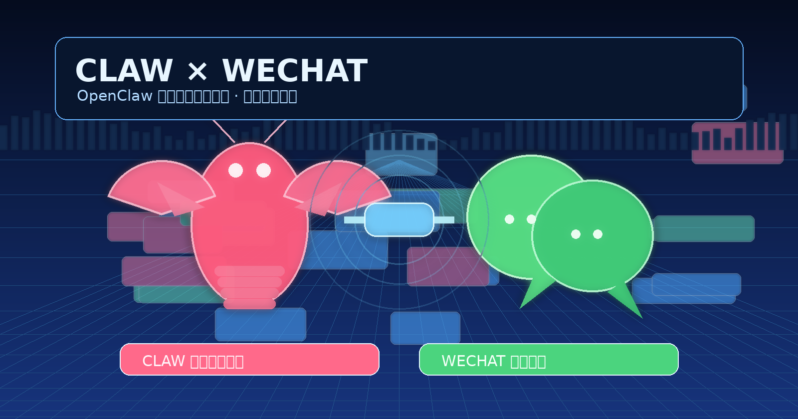

<div align="center">

# 🦞 WeChat Auto Writer（Open Edition）

[](./LICENSE)


一个面向普通用户的 OpenClaw 公众号自动化 Skill：  
输入选题后，自动完成 **写文 → 配图 → 排版 → 推送公众号草稿箱**。

> 目标：让不懂代码的运营同学，也能按文档一步步跑通全链路。

</div>

<p align="center">
  
</p>

---

## 🎯 一句话价值

把“写公众号”这件事，从零散人工操作，升级为可复用的标准流水线。

## 📚 目录

- [🎯 一句话价值](#-一句话价值)
- [✨ 功能特性](#-功能特性)
- [🧱 核心架构与工作流程](#-核心架构与工作流程)
- [🖥️ 环境要求](#️-环境要求)
- [⚙️ 基础配置（小白必看）](#️-基础配置小白必看)
- [🧠 LLM 接口与推荐配置](#-llm-接口与推荐配置)
- [🖼️ 文生图接口与推荐配置](#️-文生图接口与推荐配置)
- [🎨 主题系统（全部主题 + 选型建议）](#-主题系统全部主题--选型建议)
- [🤖 在 OpenClaw 安装本项目的方法](#-在-openclaw-安装本项目的方法)
- [📋 OpenClaw 标准操作流程（含案例命令）](#-openclaw-标准操作流程含案例命令)
- [⌨️ CLI 直接运行（不走自然语言）](#️-cli-直接运行不走自然语言)
- [🛠 常见问题](#-常见问题)
- [🔐 安全与开源发布注意事项](#-安全与开源发布注意事项)
- [🧾 许可证与作者](#-许可证与作者)

---

## ✨ 功能特性

本项目用于把公众号发文流程标准化与自动化：

- 自动生成文章（Markdown）
- 自动生成封面图与正文配图
- 自动套用排版主题并生成公众号可用 HTML
- 自动上传素材并推送到公众号草稿箱
- 自动回读校验草稿内容

适用人群：

- 公众号运营者（希望提效）
- 内容团队（希望流程标准化）
- 开发者（希望可脚本化接入）

---

## 🧱 核心架构与工作流程

核心脚本入口：`scripts/run_workflow.py`

标准流程：

1. `write_article.py`：生成文章初稿
2. `wechat_metadata.py`：提取短标题和摘要
3. `add_article_images.py`：规划正文配图位
4. `generate_image.py`：生成封面图 + 正文图
5. `compress_image.py`：压缩与尺寸规范化
6. `format_article.py`：渲染主题，转公众号 HTML
7. `publish_draft.py`：推送草稿箱并回读校验

你可以把它理解成“内容流水线”，每个步骤都有可复用输出，失败时可局部重试。

---

## 🖥️ 环境要求

基础要求：

- Linux / macOS（推荐 Linux）
- Python 3.10+
- 可访问所选 LLM 与图像模型 API
- 可访问微信公众号 API

常见依赖：

- `requests`
- `PyYAML`
- `Pillow`

如果你在 OpenClaw 环境中运行，通常可直接使用已有 Python 虚拟环境。

---

## ⚙️ 基础配置（小白必看）

### 4.1 先复制配置模板

```bash
cp config.example.json config.json
```

### 4.2 最少要填哪些字段

- `llm_candidates`（文本模型）
- `image_candidates`（图片模型）
- `appid`（公众号）
- `appsecret`（公众号）

### 4.3 推荐最小可用配置（示例）

```json
{
  "llm_candidates": [
    {
      "enabled": true,
      "provider": "openai_compatible",
      "base_url": "https://your-llm-endpoint/v1",
      "api_key": "sk-xxx",
      "model": "gpt-5",
      "retries": 2,
      "timeout": 180
    }
  ],
  "image_candidates": [
    {
      "enabled": true,
      "provider": "dashscope_image",
      "base_url": "https://dashscope.aliyuncs.com/api/v1",
      "api_key": "sk-xxx",
      "model": "qwen-image-2.0-pro",
      "retries": 1
    }
  ],
  "image_prompt_strategy": "full",
  "image_prompt_lite_content_chars": 240,
  "image_style": "轻插画",
  "appid": "wx你的公众号appid",
  "appsecret": "你的公众号appsecret"
}
```

---

## 🧠 LLM 接口与推荐配置

本项目文本侧采用 `openai_compatible` 协议接入，建议优先选择：

1. **GPT-5**（质量优先，综合稳）
2. **MiniMax M2.5**（成本/速度平衡）
3. **GLM-5**（中文表现友好）

你只需要替换：

- `base_url`
- `api_key`
- `model`

> 不同平台 endpoint 命名可能不同，请以各平台官方文档为准。

---

## 🖼️ 文生图接口与推荐配置

推荐图像模型：

- **qwen-image-2.0-pro**（`dashscope_image`）

配置要点：

- `provider`：`dashscope_image`
- `base_url`：`https://dashscope.aliyuncs.com/api/v1`（中国区）
- 或：`https://dashscope-intl.aliyuncs.com/api/v1`（新加坡）

⚠️ 注意：

- 不要给 `dashscope_image` 使用 `.../compatible-mode/v1`
- 新用户免费额度活动可能存在，但会变动，**以官方活动页实时规则为准**

可选 fallback：

- 主：`openai_compatible_images`
- 备：`dashscope_image`

---

## 🎨 主题系统（全部主题 + 选型建议）

主题使用方式：

```bash
--theme <category>/<name>
```

### 7.1 Macaron（12 个）

`macaron/blue`、`coral`、`cream`、`lavender`、`lemon`、`lilac`、`mint`、`peach`、`pink`、`rose`、`sage`、`sky`

适合：成长、教育、生活方式、轻知识内容。

### 7.2 Wenyan（8 个）

`wenyan/default`、`lapis`、`maize`、`mint`、`orange_heart`、`pie`、`purple`、`rainbow`

适合：人文、观点、散文、文化类内容。

### 7.3 Shuimo（1 个）

`shuimo/default`

适合：中式气质、养生、沉稳克制风格内容。

---

## 🤖 在 OpenClaw 安装本项目的方法

你可以把本项目 GitHub 地址交给 OpenClaw（龙虾），使用下面这条专业指令：

> 请安装这个 Skill：`<项目地址>`。安装完成后，请将其设为“公众号文章”场景默认流程；后续我提出“写公众号文章/配图/发草稿”相关需求时，请自动调用该 Skill 执行“写作 → 配图 → 排版 → 推送草稿箱”的全链路任务。

适合首次接入时一次性配置，后续只给选题即可。

---

## 📋 OpenClaw 标准操作流程（含案例命令）

下面是建议给 OpenClaw 的自然语言指令模板。

### 9.1 新写一篇

- `写一篇关于“春季养生”的公众号文章，风格干货，主题用 shuimo/default，并推送草稿箱。`

### 9.2 仿写风格

- `参考这篇文章的结构和语气仿写一篇“AI 时代个人效率系统”的公众号文，保持原创，推送草稿箱。`

### 9.3 指定排版主题

- `写一篇“低预算家庭理财入门”，排版主题用 macaron/mint，自动配图并推草稿。`

### 9.4 只生成不推送

- `写一篇“夏季减脂饮食清单”，先生成文章和配图，不要推送草稿。`

---

## ⌨️ CLI 直接运行（不走自然语言）

### 10.1 全链路（推荐）

```bash
python scripts/run_workflow.py "春季养生" \
  --style 干货 \
  --theme shuimo/default \
  --publish-draft
```

### 10.2 只生成内容，不推草稿

```bash
python scripts/run_workflow.py "春季养生" \
  --style 干货 \
  --theme shuimo/default
```

### 10.3 低成本提示词策略

```bash
python scripts/run_workflow.py "春季养生" \
  --style 干货 \
  --theme shuimo/default \
  --image-prompt-strategy lite \
  --image-prompt-lite-chars 220
```

---

## 🛠 常见问题

- **502 Bad Gateway**：上游接口波动，重试或依赖 fallback。
- **404 Not Found**：大多是 `base_url` / 路径配置错误。
- **429 Rate Limit**：触发限流，降低请求频率后重试。
- **草稿推送失败**：检查 `appid/appsecret`、公众号 API 权限和白名单。

---

## 🔐 安全与开源发布注意事项

- 不要提交 `config.json`
- 不要提交真实 API Key、公众号密钥、生产输出
- 密钥疑似泄露请立即轮换
- 公开发布前执行：`RELEASE_CHECKLIST.md`

---

## 🧾 许可证与作者

Copyright © 2026 煜耀乾坤  
GitHub: https://github.com/yuyaoqiankun

本项目采用 MIT License，详见 `LICENSE`。
